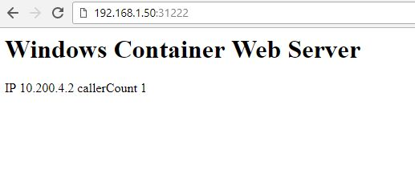

# kubernetes-for-windows

**NOTE: work in progress - Kubernetes networking heavily relies on Windows HNS which is still unstable.**

[Ansible](https://www.ansible.com/) playbooks and [Packer](https://www.packer.io/) templates for provisioning of Hyper-V [Vagrant](https://www.vagrantup.com/) boxes and configuration of hybrid Kubernetes 1.10+ cluster with Flannel network (host-gw backend). Currently supports:
- Windows Server 1803 (March 2018) as Kubernetes nodes with Docker 17.10.0-ee-preview-3.
- Ubuntu 16.04 LTS (Xenial) as Kubernetes master and nodes with Docker 17.03.
- Cluster initialization using [kubeadm](https://kubernetes.io/docs/setup/independent/create-cluster-kubeadm/) (both Windows and Linux nodes).
- Flannel pod network, host-gw backend (vxlan can be also installed, requires changes in network deployment file and installation of CNI plugins on Windows). Based on https://github.com/coreos/flannel/pull/921 and https://github.com/containernetworking/plugins/pull/85 by [rakelkar](https://github.com/rakelkar).
- Configurable pod/service CIDRs.
- Deployment of [Microsoft SDN](https://github.com/Microsoft/SDN) github repository do Windows nodes in order to make debugging easier.
- Exposing NodePort services on both Windows and Linux nodes.
- Packer templates with Ansible support which can be executed on Windows hosts, thanks to Powershell wrappers for Ansible commands ([ptylenda/ansible-for-windows-wsl-powershell-fall-creators-update](https://github.com/ptylenda/ansible-for-windows-wsl-powershell-fall-creators-update)). Similar solution was used in demo Packer template in [ptylenda/packer-template-ubuntu1604-ansible-proxy](https://github.com/ptylenda/packer-template-ubuntu1604-ansible-proxy).
- Provisioning and configuration behind a proxy.
- Workaround for https://github.com/OneGet/MicrosoftDockerProvider/issues/15 by pablodav.

Ansible playbooks provided in this repository have been initially based on the official Microsoft [Getting Started](https://docs.microsoft.com/en-us/virtualization/windowscontainers/kubernetes/getting-started-kubernetes-windows) guide for Kubernetes on Windows. Most of the original scripts in this guide have been replaced by Ansible tasks and NSSM windows services, and on top of that experimental Flannel support with host-gw backend has been added.

The original *kubernetes-for-windows* was modified by @pablodav trying to reuse more parts from external projects to deploy k8s on linux and focusing this project only on the required parts to add a windows node to the existing kubernetes cluster. For that reason @pablodav have removed most parts of k8s for linux and started to deploy k8s with kubespray then adding this project as integrated part of that to deploy *win_node*, but the modifications are done thinking in the possibility to integrate with any other k8s project that uses kubeadm (this project uses kubeadm to generate tokens to join the win_node).

## Known issues and limitations

 1. I have not managed to make kube-proxy working in kernelspace proxy-mode (for more information concerning debugging please check my messages on [#sig-windows](https://kubernetes.slack.com/messages/sig-windows) on Kubernetes Slack. As a workaround, userspace proxy-mode is used.
 2. Flannel network (host-gw backend) is highly experimental. The following communication schemes have been validated:
    - [x] Pod-to-pod internal communication between Windows pods using IP.
    - [x] Pod-to-pod internal communication between Windows pods using DNS.
    - [x] Pod-to-pod internal communication between Windows and Linux pods using IP.
    - [x] Pod-to-pod internal communication between Windows and Linux pods using DNS.
    - [x] Pod-to-pod internal communication between Linux pods using IP.
    - [x] Pod-to-pod internal communication between Linux pods using DNS.
    - [x] Pod-to-service internal communication between Linux pod and Windows service using IP.
    - [x] Pod-to-service internal communication between Linux pod and Windows service using DNS.
    - [x] Pod-to-service internal communication between Windows pod and Linux service using IP.
    - [x] Pod-to-service internal communication between Windows pod and Linux service using DNS.
    - [x] External communication to NodePort service via Windows node.
    - [x] External communication to NodePort service via Linux node.
    - [x] Communication with external IPs (i.e. outbound NAT) from Linux pods.
    - [ ] Communication with external IPs (i.e. outbound NAT) from Windows pods - **this is the most significant issue, with current Windows HNS and Hyper-V Virtual Switch it is not possible to achieve outbound NAT without losing pod-to-pod communication from Windows nodes**. 
 3. There are problems with automatic configuration of DNS in Windows pods (depends on Windows version). Some workarounds have been posted in this [azure-acs-engine issue](https://github.com/Azure/acs-engine/issues/2027).
 4. It is not possible to use Ansible Remote provisioner with Ansible 2.5.0 and Packer 1.2.2 for Windows nodes due to the following exception:
```shell
ntlm: HTTPSConnectionPool(host='127.0.0.1', port=63008): Max retries exceeded with url: /wsman (Caused by SSLError(SSLError(1, u'[SSL: UNKNOWN_PROTOCOL] unknown protocol (_ssl.c:590)'),))
```
Similar issues are present with Ubuntu templates:
```shell
SSH Error: data could not be sent to remote host \"127.0.0.1\". Make sure this host can be reached over ssh
```
Unfortunately I did not have time to investigate this issue yet, but the Packer provisioning process used to work on lower versions of Ansible and Packer.

4. The playbooks have been also tested with latest Windows Server Insider Program builds but it requires altering playbooks, so that proper base container image for Kubernetes infra container is downloaded (insider and non-insider container images are not compatible).

## Prerequisites
Ansible only:
1. Windows 10 Fall Creators update ([1709](https://support.microsoft.com/en-us/help/4028685/windows-10-get-the-fall-creators-update)) as Hyper-V host and Ansible master.
2. Ubuntu for Windows (WSL) installed.
3. Ansible 2.5.0+ installed on Ubuntu for Windows (pip installation recommended).
4. Additional python packages installed for WinRM (follow [Ansible Windows Setup Guide](http://docs.ansible.com/ansible/2.5/user_guide/windows_setup.html)).
5. Windows Server 1803 (March 2018) installed on Windows Kubernetes nodes.
6. WinRM properly configured on Windows Kubernetes nodes.
7. Ubuntu 16.04 LTS (Xenial) installed on Linux master and nodes.

\+ Packer:
1. Packer 1.2.2+ installed on Windows host (visible in PATH).
2. Windows Server 1709 (Jan 2018) ISO downloaded. 
3. Ubuntu 16.04 LTS (Xenial) ISO downloaded.

## Flannel and CNI plugins for Windows notes
Windows has limited support for different pod networks, as mentioned in [official Kubernetes Windows guide](https://kubernetes.io/docs/getting-started-guides/windows/). Flannel with host-gw (and vxlan) backends and appropriate CNI plugins are currently in experimental stage and are available as the following pull requests by [rakelkar](https://github.com/rakelkar):
https://github.com/coreos/flannel/pull/921
https://github.com/containernetworking/plugins/pull/85
Unfortunately, these original pull requests had some minor issues which had to be fixed or worked around:
1. When kubeproxy is running in userspace mode, it will attach multiple interfaces for services to cbr0 interface. This results in Flannel being confused and not identifying cbr0 interface properly. This has been addressed by https://github.com/rakelkar/flannel/pull/8.
2. clusterNetworkPrefix and endpointMacPrefix JSON properties are not parsed properly by CNI plugins. Workaround is available as a part of https://github.com/rakelkar/plugins/pull/5, but there is also a cleaner solution provided here: https://github.com/containernetworking/plugins/pull/85#issuecomment-370507317
3. https://github.com/rakelkar/plugins/pull/5 attempts at working around Outbound NAT creation problems in HNS. This part is troublesome, as it disables pod-to-pod communication on Windows nodes. **This should probably be removed.**
##  Ansible usage
### Step 1 - Install prerequisites
First, install all prerequisites from the previous paragraph. Ensure that a basic Ansible playbook is working properly when using Ubuntu for Windows (WSL) for both Windows and Linux nodes.
### Step 2 - Prepare inventory file
A sample inventory file has been provided in [Ansible playbook directory](ansible/inventory). Assuming that you would like to create cluster having the following hosts:

 - Master node: ubuntu01, ubuntu02
 - Linux nodes: ubuntu02, ubuntu03
 - Windows nodes: windows01, windows02

your inventory should be defined as:
```
# ## Configure 'ip' variable to bind kubernetes services on a
# ## different ip than the default iface
# node1 ansible_host=95.54.0.12  # ip=10.3.0.1
# node2 ansible_host=95.54.0.13  # ip=10.3.0.2
# node3 ansible_host=95.54.0.14  # ip=10.3.0.3
# node4 ansible_host=95.54.0.15  # ip=10.3.0.4
# node5 ansible_host=95.54.0.16  # ip=10.3.0.5
# node6 ansible_host=95.54.0.17  # ip=10.3.0.6

# This inventory is based on an integrated inventory with kubespray
# the kube-master, kube-node, etcd, kube-ingres, k8s-cluster comes from kubespray
# https://github.com/kubernetes-incubator/kubespray/blob/master/docs/integration.md
# https://github.com/kubernetes-incubator/kubespray/blob/master/inventory/sample/hosts.ini

[Location1]
ubuntu01  ansible_host=10.3.0.1
ubuntu02  ansible_host=10.3.0.2
ubuntu03  ansible_host=10.3.0.3

# ## configure a bastion host if your nodes are not directly reachable
# bastion ansible_host=x.x.x.x ansible_user=some_user

[kube-master]
ubuntu01
ubuntu02

[etcd]
ubuntu01
ubuntu02
ubuntu03

[kube-node]
ubuntu02
ubuntu03

[kube-ingress]
ubuntu02
ubuntu03

[k8s-cluster:children]
kube-master
kube-node
kube-ingress

# Add group of master-ubuntu for kubernetes-for-windows project
[master-ubuntu:children]
kube-master

[node-windows]
windows01 kubernetes_node_hostname=windows01 ansible_host=10.3.0.4
windows02 kubernetes_node_hostname=windows02 ansible_host=10.3.0.5

[node:children]
node-windows

# This k8s-cluster-local is a group added to add all variables inside that group
# all variables for kubespray and for kubernetes-for-windows projects in your group_vars inventory
[k8s-cluster-local:children]
k8s-cluster
node-windows

[all-ubuntu:children]
master-ubuntu

```
The host variable ``kubernetes_node_hostname`` will be used as Windows hostname and at the same time it will be used to identify node in Kubernetes.
Any other variables that you wish to configure are available in [group_vars](ansible/inventory/group_vars) you must copy these vars to your own *group_vars* dir, for example cluster/service pod CIDRs.

You will find more vars for kubespray roles in *k8s-cluster-local*, the vars added here already have flannel and are integrated with vars for kubernetes-for-windows.

### Step 3 - Integrate kubespray and kubernetes-for-windows in your playbooks

---

We are using steps from [kubespray integration](https://github.com/kubernetes-incubator/kubespray/blob/master/docs/integration.md)

First you must have an ansible git repo, if not init one:

    git init

Then copy these files to your inventory:

```shell
├── ansible.cfg  # It will have the roles_path and library path you can read and add to your own ansible.cfg file
├── inventory  # For all files in inventory you have a sample in this project
│   ├── kubernetes.ini 
│   ├── group_vars
│   │   ├── k8s-cluster-local  # Directory with vars for group k8s-cluster-local
│   │   │   ├── all-k8s.yml
│   │   │   ├── k8s-cluster.yml
│   │   │   └── k8s-win.yml
├── roles.kubernetes.yml  # It will have all kubespray and kubernetes-for-windows import playbooks
```

Also create directory:

```shell
mkdir -p roles/3d
```

Then add as submodules kubespray and kubernetes-for-windows to use these roles:

```shell
git submodule add https://github.com/kubernetes-incubator/kubespray.git roles/3d/kubespray
git submodule add https://github.com/pablodav/kubernetes-for-windows roles/3d/kubernetes-for-windows # hope in future we can agree with main author of it to use his repository https://github.com/ptylenda/kubernetes-for-windows
```

You must have now:

```shell
ls -1 roles/3d/
kubernetes-for-windows
kubespray
```

Now you have all the roles and variables ready, just install the requirements from kubespray:

```shell
sudo pip install -r roles/3d/kubespray/requirements.txt
```

### Step 4 - Install Kubernetes packages using roles.kubernetes.yml playbook

---

In order to install basic Kubernetes packages on Windows and Linux nodes, run ``roles.kubernetes.yml`` playbook:

```shell
ansible-playbook roles.kubernetes.yml -i inventory/kubernetes.ini -b -v
```

You can also install only linux with kubespray:

```shell
ansible-playbook roles.kubernetes.yml -i inventory/kubernetes.ini --tags role::kubespray -b -vvv
```

And then the windows nodes:

```shell
ansible-playbook roles.kubernetes.yml -i inventory/kubernetes.ini --tags role::kubernetes-for-windows -b -vvv
```

You will notice that the role with tag `role::kubernetes-for-windows` will patch kube-proxy and kube-flannel:

```shell
kubectl get ds -n kube-system
NAME           DESIRED   CURRENT   READY     UP-TO-DATE   AVAILABLE   NODE SELECTOR                 AGE
kube-flannel   3         3         3         3            3           beta.kubernetes.io/os=linux   34m
kube-proxy     3         3         3         3            3           beta.kubernetes.io/os=linux   8d
```

So the daemonset will not be deployed in windows.

The playbook consists of the following stages:

1. Installation of common modules on Windows and Linux. This includes various packages required by Kubernetes and recommended configuration, setting up proxy variables, updating OS, changing hostname. (For linux it installs from kubespray modules)
2. Docker installation. On Windows, at this stage, appropriate Docker images are being pulled and tagged for compatibility reasons, as mentioned in official Microsoft [guide](https://docs.microsoft.com/en-us/virtualization/windowscontainers/kubernetes/getting-started-kubernetes-windows#creating-the-pause-image).
3. CNI plugins installation. On Windows, custom plugins are downloaded based on this [repository](https://github.com/ptylenda/plugins/tree/windowsCni) which is a fork of https://github.com/containernetworking/plugins/pull/85 by [rakelkar](https://github.com/rakelkar).
4. Kubernetes packages installation (currently 1.10). On Windows, there are also NSSM services created for kubelet and kube-proxy (in 1.10 it should be possible to create the services natively, however it has not been tested here)
5. On Windows, custom Flannel is installed based on this [repository](https://github.com/ptylenda/flannel/tree/windowsHostGw180115) which is a fork of https://github.com/coreos/flannel/pull/921 by [rakelkar](https://github.com/rakelkar)


Filtering by ``init`` tag omits installation of Kubernetes packages which have been already installed in Step 3.
Installation consists of the following stages:
##### Master initialization
1. All installation is performed with kubespray kubeadm vars are selected in our sample
4. Kube config is copied to current user's HOME.
5. [RBAC role and role binding](ansible/roles/ubuntu/kubernetes-master/files/kube-proxy-node-rbac.yml) for standalone kube-proxy service is applied. It is required for Windows, which does not host kube-proxy as Kubernetes pod, i.e. it is hosted as a traditional system service.
6. An additional node selector for kube-proxy is applied. Node selector ensures that kube-proxy daemonset is only deployed to Linux nodes. On Windows it is not supported yet, hence the standalone system service.
7. Flannel network node selector ``beta.kubernetes.io/os: linux`` has been added in order to prevent from deploying on Windows nodes, where Flannel is being handled independently.
##### Ubuntu nodes initialization
1. all done with kubespray
##### Windows nodes initialization
1. Node joins cluster using kubeadm and token generated on master. Works exactly the same as for Linux nodes.
2. Old Flannel routes/networks are deleted, if present. HNS endpoints/policies are deleted, all the operations are performed by [kube-cleanup.ps1](ansible/roles/windows/kubernetes-node/files/kube-cleanup.ps1) script.
3. Flannel, kubelet and kube-proxy are started (and restarted) in a specific sequence. Flannel is not fully operational during the first execution and it requires restarting (probably a bug).

Right now the cluster is fully functional, you can proceed with deploying an example Windows service.

The playbook is idempotent, so you can add more nodes to an existing cluster just by extending inventory and rerunning the playbook.
### Step 5 - Deploying an example Windows service
[win-webserver.yml](ansible/roles/ubuntu/demo-deployment/files/win-webserver.yml) contains an example Deployment and Service based on Microsoft [guide](https://docs.microsoft.com/en-us/virtualization/windowscontainers/kubernetes/getting-started-kubernetes-windows#running-a-sample-service). In order to deploy the web service execute:
```
kubectl apply -f win-webserver.yaml
```
This will also deploy a Kubernetes NodePort Service which can be accessed on every Kubernetes node, both Windows and Linux, for example:



### Step 6 - Resetting Kubernetes cluster
If you wish to tear down the cluster, without destroying the master node, execute the following playbook:
```
ansible-playbook -i inventory reset-kubeadm-cluster.yml
```
This will reset only windows node, to reset linux cluster follow the kubespray steps. [Remove nodes](https://github.com/kubernetes-incubator/kubespray/blob/master/docs/getting-started.md#remove-nodes)

## Packer usage

Actually it needs review, to integrate kubespray so it is not working as it was working before.

For easier usage of Packer with Ansible Remote provisoner on Windows, an additional wrapper script has been provided: [packer-ansible-windows.ps1](packer/windows/packer-ansible-windows.ps1). Basically it adds Ansible wrappers to PATH and ensures that proxy settings are configured properly.

ISO files are expected to be loaded from ``./iso`` subdirectory in packer build space. For Ubuntu it is also possible to download the image automatically from the official http server. For Windows you have to provide your own copy of Windows Server 1803 ISO.

To build Windows node on Hyper-V:

	$  .\packer-ansible-windows.ps1 build --only=hyperv-iso .\kubernetes-node-windows1803-march2018.json

Default user: ubuntu

Default password: ubuntu

(configurable in template variables)

To build Ubuntu node/master on Hyper-V:

	$ .\packer-ansible-windows.ps1 build --only=hyperv-iso .\kubernetes-node-ubuntu1604.json

Default user: Administrator

Default password: password

(configurable in template variables AND in http\Autounattend.xml file, which does not support templating)

## Additional notes for Packer and Ubuntu 16.04 LTS template
This template has been created in order to resolve problems with provisioning Ubuntu Server 16.04 behind a proxy. Keep in mind that:
- If you need to configure apt-get proxy from Packer template, you cannot use `choose-mirror-bin mirror/http/proxy string addr`. It is not possible to customize `addr` in this case.
- Using `choose-mirror-bin mirror/http/proxy string addr` in preseed.cfg has different impact compared to using `mirror/http/proxy=addr` from boot parameters. The latter also affects downloading preseed.cfg from http server (seems like a debconf bug).
- Downloading preseed.cfg from `preseed/url` is sensitive to proxy settings inherited from `mirror/http/proxy` (which seems contrary to description of this parameter). Fortunately I have discovered that setting `no_proxy={{ .HTTPIP }}` environment variable from boot parameters is enough to force no proxy for wget in order to communicate with Packer http server.
- There is a limitation for Boot Options length that can be used when installing Ubuntu using QEMU. This means that there may be not enough place to type all commands connected with keyboard settings when using proxy, but you can use `auto-install/enable=true` and feed them from preseed.cfg
- For Hyper-V, if you would like to use Gen. 2 machines, you can't use floppies (https://technet.microsoft.com/en-us/library/dn282285(v=ws.11).aspx), therefore you have to stick to `preseed/url` method for providing preseed.cfg.
- For Hyper-V, it is important to perform `d-i preseed/late_command string in-target apt-get install -y --install-recommends linux-virtual-lts-xenial linux-tools-virtual-lts-xenial linux-cloud-tools-virtual-lts-xenial;`, directly in preseed.cfg, *BEFORE* any provisioner runs. These packages are needed in order to discover IP address of VM properly so that Packer can connect via SSH. Otherwise it will be waiting for IP address forever, more details can be found in "Notes" in https://docs.microsoft.com/en-us/windows-server/virtualization/hyper-v/supported-ubuntu-virtual-machines-on-hyper-v
- For shell provisioners and propagation of proxy settings, use:
```
"environment_vars": [
    "FTP_PROXY={{ user `ftp_proxy` }}",
    "HTTPS_PROXY={{ user `https_proxy` }}",
    "HTTP_PROXY={{ user `http_proxy` }}",
    "NO_PROXY={{ user `no_proxy` }}",
    "ftp_proxy={{ user `ftp_proxy` }}",
    "http_proxy={{ user `http_proxy` }}",
    "https_proxy={{ user `https_proxy` }}",
    "no_proxy={{ user `no_proxy` }}"
  ]
```
- For ansible-local provisioner use:
```
"extra_arguments": [
    "--extra-vars",
    "{'\"http_proxy\":\"{{ user `http_proxy` }}\", \"https_proxy\":\"{{ user `https_proxy` }}\", \"no_proxy\":\"{{ user `no_proxy` }}\", \"ftp_proxy\":\"{{ user `ftp_proxy` }}\"}'"
  ]
  ```
Then handle these variables appropriately in playbook, set environment variables, etc.
- In case of ansible-local there are problems when specifying inventory_groups: even though connection type passed to ansible is "local", it gets ignored and regular SSH connection is used. This causes problems due to unauthorized key for passwordless login to localhost. As a workaround you have to specify inventory_file with ansible_connection specified explicitly, for example:
```
[linux]
127.0.0.1 ansible_connection=local
```

Additional notes about windows performance
==========================================

Exclude windows defender on docker path and exe files:

```shell
Add-MpPreference -ExclusionPath C:\ProgramData\docker\
set-MpPreference -ExclusionProcess "dockerd.exe, flanneld.exe, kube-proxy.exe, kubelet.exe"
```

Or exclude the docker path in your antivirus.

In case of doubt with windows defender, disable it temporarly:

```shell
Set-MpPreference -DisableRealtimeMonitoring $true
```

Some other troubleshooting tweaks
=================================

Networking with kube-proxy and flanneld services
------------------------------------------------

Service start order matters, in some tests I (pablodav) have confirmed that this order is required to get all network devices and IP addresses created during start:

1. docker
2. kubelet
3. kube-proxy
4. flanneld

For that reason I have added serialized dependencies on nssm service config on tasks.
